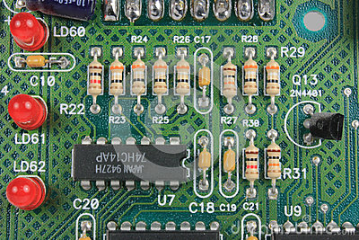
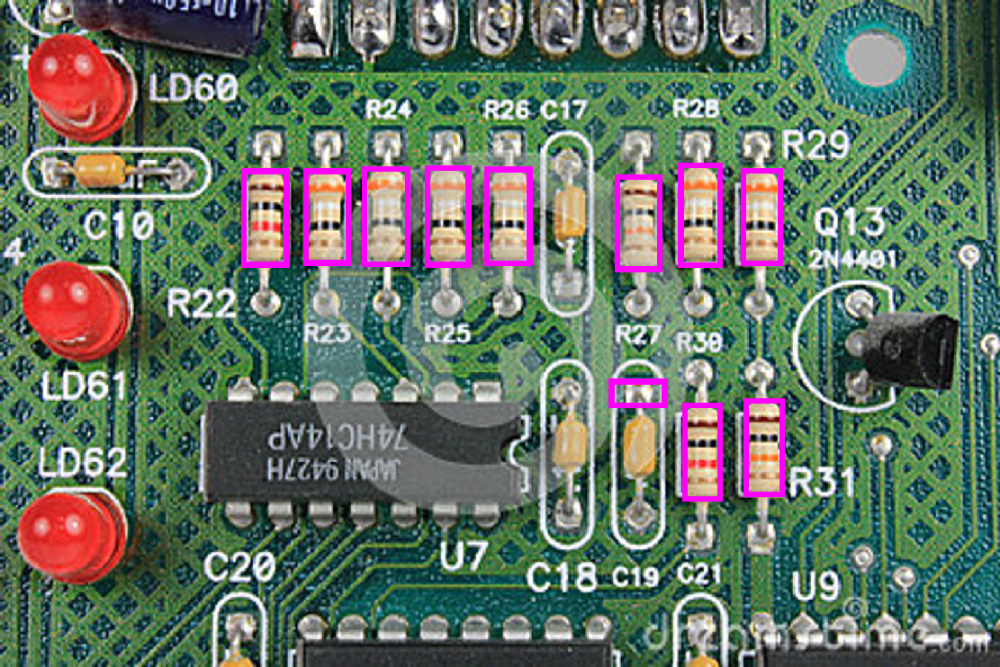
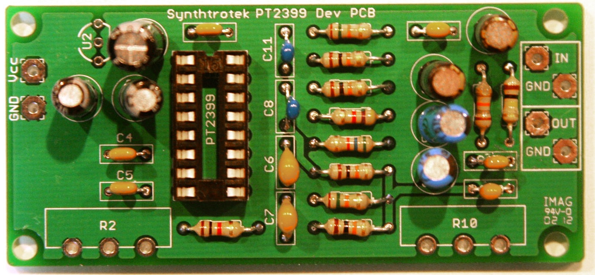
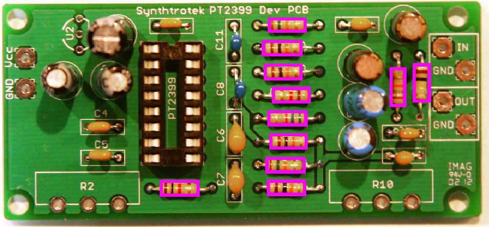
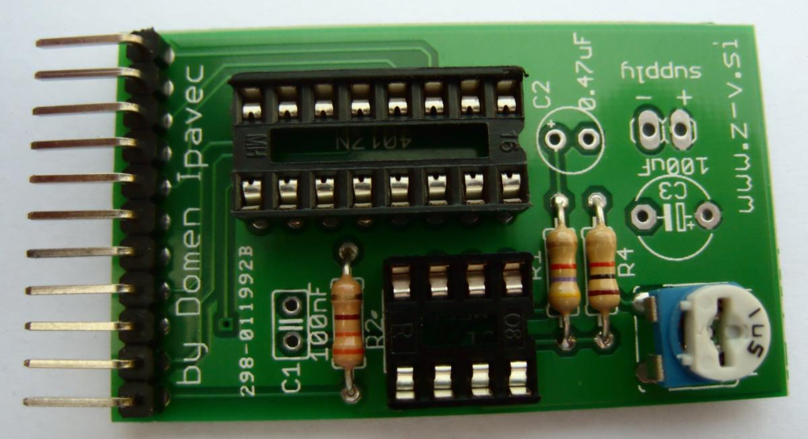
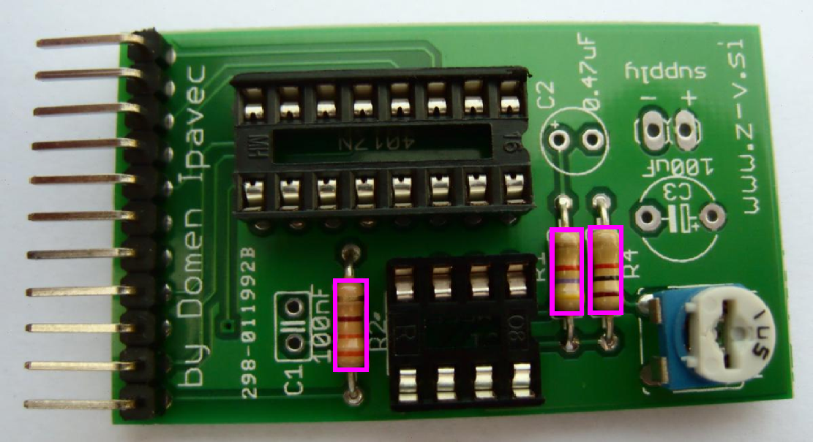
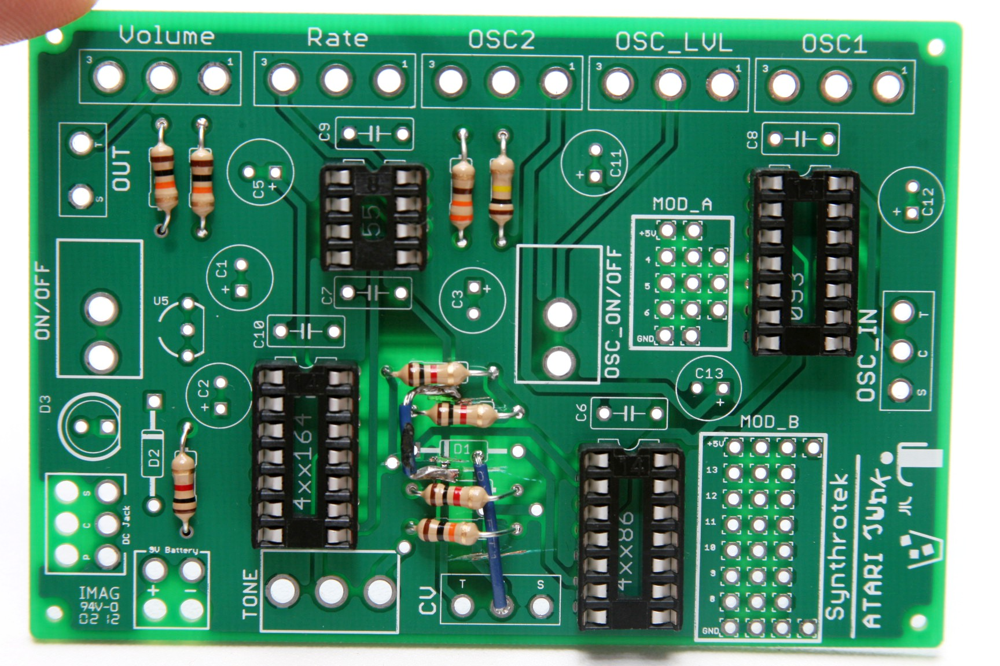
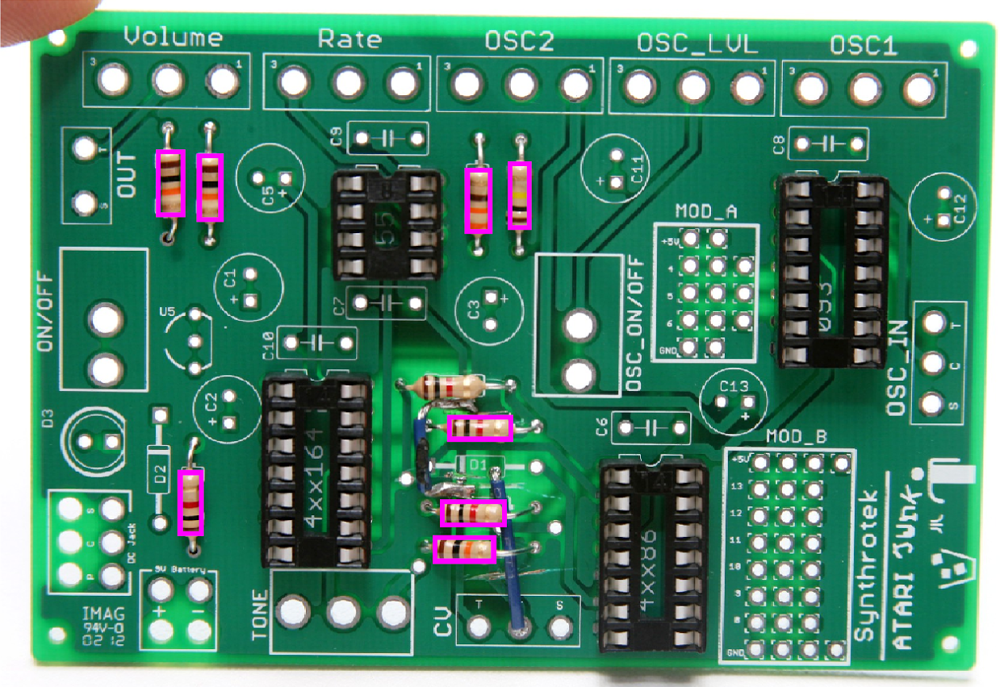

# ResistorRecognition

Designed to detect resistors in an input image and output the image with bounding boxes around the detected resistors. 

For best results, images should adhere to this checklist:
  <ul>
  <li>good lighting, no dramatic shadows or highlights</li>
  <li>aerial, orthogonal perspective (no occluding objects, 90 degree corners)</li>
  <li>circuit board is a shade of green</li>
  <li>resistors are of the kind shown in the sample images below (tan background, same shape, size)</li>
  </ul>
<table>
<th> INPUT </th>
<th> OUTPUT </th>
<tr>
  <td>  </td>
  <td>  </td>
</tr>
<tr>
  <td>  </td>
  <td>  </td>
</tr>
<tr>
  <td>  </td>
  <td>  </td>
</tr>
<tr>
  <td>  </td>
  <td>  </td>
</tr>
